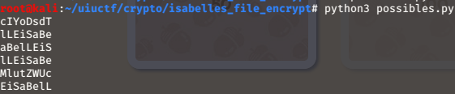
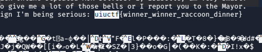

## Description

Isabelle wanted to password-protect her files, but there wasn't any room in the budget for BitLocker! So she made her own program. But now she lost her password and can't decrypt one of her super important files! Can you help her out?

## Included Files

blackmail_encrypted
super_secret_encryption.py

## Writeup

The included files for this challenge are a file that has apparently been encrypted using the also included Python script. In the script there is an encryption function and its corresponding decryption function. Immediately striking is that the encryption function requires that the password be exactly 8 characters long, only alphabetic characters, and that the file is going to contain the exact string "Isabelle". That already greately reduces the possibilities, and makes cracking the password simpler by several orders of magnitude. The next key to solving this challenge is knowing that every byte in the file to be encrypted will get processed against a single character in the password in order, so the file is encrypted in blocks of 8 characters. It's actually pretty unimportant what the method of encryption they use is since we're also given a decryption method, except for maybe just to understand that the same input with the same password will always give the same output that can be decrypted in kind. However, just for anyone wondering, it takes a character from the message to be encrypted, moves the bit at the end of that byte to the beginning, and then xors that against a character in the password. It would be necessary to understand that if we weren't given a decryption function, but since we were we only need to copy-paste what they've given us. 

    def super_secret_encryption(file_name, password):
      with open(file_name, "rb") as f:
        plaintext = f.read()
      
      assert(len(password) == 8) # I heard 8 character long passwords are super strong!
      assert(password.decode("utf-8").isalpha()) # The numbers on my keyboard don't work...
      assert(b"Isabelle" in plaintext) # Only encrypt files Isabelle has been mentioned in
      add_spice = lambda b: 0xff & ((b << 1) | (b >> 7))
      ciphertext = bytearray(add_spice(c) ^ password[i % len(password)] for i, c in enumerate(plaintext))
    
      with open(file_name + "_encrypted", "wb") as f:
        f.write(ciphertext)

With the given knowledge in mind, I knew I could get a list of possible passwords through brute force by decrypting all the substrings in the given encrypted file and looking for the string "Isabelle". Without the known restrictions the time taken for this task would've balloooned very quickly, but we only needed to check substrings of length 8, and there were only 52 possibilities for each character of the password, pretty manageable. 

    fd = open('blackmail_encrypted', 'rb')
    
    search_str = "Isabelle"
    alpha = "ABCDEFGHIJKLMNOPQRSTUVWXYZabcdefghijklmnopqrstuvwxyz"
    remove_spice = lambda b: 0xff & ((b >> 1) | (b << 7))
    
    line = fd.read()
    
    for i in range(len(line)-8):
        poss_key = ""
    
        for j,c in enumerate(line[i:i+8]):
            for curr in alpha:
                if chr(remove_spice(c ^ ord(curr))) == search_str[j]:
                    poss_key = poss_key + curr
    
        if len(poss_key) == 8:
            print(poss_key)

And here's what I got out, which was actually a lot less than I expected.

This is where knowing that the encryption works in 8 character blocks comes in handy. If you just started taking these and plugging them in to see which one would decrypt the file successfully, you'd be amiss. You have to remember that the encryption merely checks if the string "Isabelle" exists in the file, there's no guarantee that it will start at the beginning of an 8 character block. When it decrypts it might start decrypting in the middle of the password and wrap around it. And looking at the possible passwords it's easy to see that several of them form a recognizable pattern that leads you to safely assume they are just shifted versions of "iSaBelLE". Passing that through the decryption function gives you a file that, at first glimpse, looks to be a JPEG, but doing a search for the flag prefix will save some headache since the flag is in the file as text.

