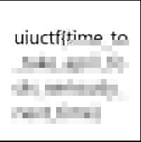
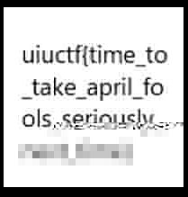
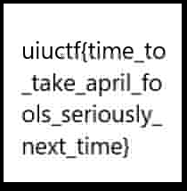

## Description

All RFCs are created equal, right?

## Included Files

challenge.pcap

## Writeup

Opening up the provided pcap we're faced with a collection of equally abrupt TCP connections. All of them are from one IP address (10.136.127.157) to a single port on another (10.136.108.29:1337). Following any particular stream shows some base64 encoded data passed in json and a response that merely repeats the size of the message sent in a variety of cartoonish phrases. Since there weren't any other varieties of packets to contend with I could manage with a simple filter to single out all of the base64 data.

    data.data ~ "{.*}"

This provided me with 314 data packets. I selected all of them and exported them into a single file. I took to vim to sanitize it with a couple of substitutions made possible by the predictability of the data format:

    :%s/.*data": "\(.*\)".*$/\1/
    :%s/^[a-zA-Z0-9\/].*$\n//

I had already decoded a few of the base64 strings that mostly just looked like random binary data, so I first decided to go full into just consecutively decoding them all into the same file and see what I came out with on the other end. To this end I put together a decoder in Go (I'm learning Go right now, so if I could have done something more idiomatic please feel free to share, however keep in mind I shirk off a lot of proper programming techniques due to the specific one-shot nature of the code.)

    func main() {
    	fd, _ := os.Open("data_packets.pcap")
    	new_fd, _ := os.Create("./decoded")
    
    	scanner := bufio.NewScanner(fd)
    	scanner.Scan()
    	
    	for scanner.Scan() { 
    		eq_count := 0
    		scan_str := scanner.Text()[0:len(scanner.Text())]
    		in_str, scan_err := b64.StdEncoding.DecodeString(scan_str)
    
    		for scan_err != nil && eq_count < 2 {
    			scan_str = scan_str + "="
    			eq_count++
    			in_str, scan_err = b64.StdEncoding.DecodeString(scan_str)
    		}
    
    		new_fd.Write(in_str)
    	}
    
    	if err := scanner.Err(); err != nil {
    		fmt.Println(err)
    	}
    
    	return
    
    }

Things look promising when file and exiftool tell me I've got a jpeg, but opening up gives me no luck. Opening it up and digging in further shows me that there are several JFIF beginning and ending bytes, and not necessarily in the proper order so simply carving up my monolithic data file won't do. I decoded a few more of the strings and was starting to become apparent was that they were all either beginnings, middles, or ends of images, and not in order. So I retooled my Go code to separate each one out accordingly.

    func main() {
    	fd, _ := os.Open("data_packets.pcap")
    	beg_count := 0
    	mid_count := 0
    	end_count := 0
    
    	scanner := bufio.NewScanner(fd)
    	scanner.Scan()
    	
    	for scanner.Scan() { 
    		eq_count := 0
    		scan_str := scanner.Text()[0:len(scanner.Text())]
    		in_str, scan_err := b64.StdEncoding.DecodeString(scan_str)
    		new_fd, _ := os.Create("./holder")
    
    		for scan_err != nil && eq_count < 2 {
    			scan_str = scan_str + "="
    			eq_count++
    			in_str, scan_err = b64.StdEncoding.DecodeString(scan_str)
    		}
    
    		if in_str[0] == '\xff' && in_str[1] == '\xd8' {
    			new_fd, _ = os.Create("./begins/beg" + strconv.Itoa(beg_count))
    			beg_count++
    		} else if in_str[len(in_str)-2] == '\xff' && in_str[len(in_str)-1] == '\xd9' {
    			new_fd, _ = os.Create("./ends/end" + strconv.Itoa(end_count))
    			end_count++
    		} else {
    			new_fd, _ = os.Create("./mids/mid" + strconv.Itoa(mid_count))
    			mid_count++
    		}
    
    		new_fd.Write(in_str)
    	}
    	if err := scanner.Err(); err != nil {
    		fmt.Println(err)
    	}
    	return
    }

Browsing the results in a file manager gave me a better idea of the sorts of images I was looking with, since just having the start of a jpeg gives you some sort of image, even if it is a bit corrupted. Most looked to be stock images, but one certainly stood out.

It was clear I'd have to combine this with other data segments to get the whole flag, but there wasn't much of a way for me to tell which middle and end segments were going to correspond to this beginning segment. I could start to look into the some RFCs to see if there might be some structural clues that would identify things, which might require writing more code to match segments together. Or I could go back to the pcap and see if there were any hints as to which segments belong to which image, perhaps there is a protocol being used that I'm not familiar with that I could look into an RFC for. This challenge was called rfcland after all. In the end I just went with the simple, stupid method and just started combining them together to see what I got.

    for i in $(ls mids); do cat begins/beg42 mids/${i} > combos/beg42+${i}; done;

Almost there. I tried the same thing combing this result with some ends, but didn't get anything good, so I went back and remixed with all the middles again and ended up with the flag, all without having to read a single RFC.

