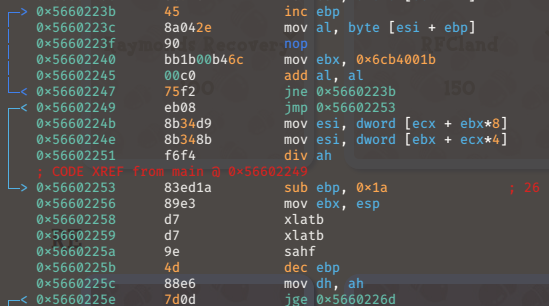
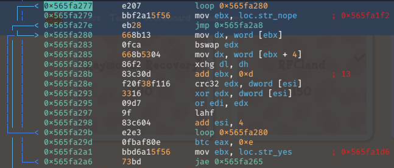
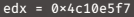
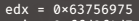
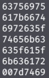

## Description

Flick will pay 390 bells for this cricket.

## Included Files

cricket32.S

## Writeup

It was a nice change of pace from all of the other pwn/re/kernel exploit challenges in this competition to just get a small assembly source code to work with. I started off by compiling it and running it through radare2 to see what was going on as we stepped through the program. If you're used to only reversing compiled C binaries then this was a bit different. No library or system calls, several instructions that aren't typically produced by gcc, and just some general ways of doing certain routines that you just wouldn't see from compiled C code.

For instance, one of the first things you get into in the program is this loop:

In typical compiled code you would expect ebp to serve its purpose of pointing to the base of the stack, and anything done do it would be in service of that purpose. However, this program doesn't really make use of the stack at all, so ebp instead gets used as an index to the string you pass in as an argument, and ultimately as a determinant of how long that string is. The goal at this point of the program is that we want to have input a string that is longer than 26 characters in length so that we pass that jg check and skip over getting slapped with the "nope" string and proceed to see what else the challenge has to offer in this loop:

Here we get into the real meat and potatoes of the program, and at first it doesn't make much sense. But to attempt to walk through what's going on: ebx holds the address to another point in the program (not a string, not any particular data, nor function, but just a point to some instructions). It loads the first two instruction bytecodes into the low bytes of edx, then changes the byte order of edx, loads the next two bytecodes from the position ebx points to, swaps those lower bytes with each other, and then moves ebx ahead 13 bytes for the next time it gets called in the loop. Then edx, the garbled up mess of instruction byte codes from who knows where in the program, gets passed as the destination register for a call to the builtin crc32 instruction with a double word from our passed in flag as the source. I really had to step through to figure out what was going to happen next.

Here is edx before the crc32 instruction executes with all of its little swapped around bytecodes:

And here it is after:

Which, is the first four bytes of the flag I passed in, "uiuc", which we knew to at least be the beginning of the flag. Then edx gets xor'd against those same four bytes and or'd onto edi, which later gets checked whether or not it's 0 when decided whether the flag was correct or not. So, what kuilin, who wrote this, did is find a consistent series of bytecodes in the binary itself to grab and manipulate, and then use in executing the crc32 instruction with four bytes from the flag that would result in the exact same four bytes as the flag you input! For each four byte segment of the flag!

After getting a decent understanding of what was going on I stepped through it a couple of times with a few a different inputs to make sure that the values being set for edx were the same every time, and recorded what they were. With all of that set up I just made a little function with some inline assembly to make use of the crc32 instruction and a check to see whether the input was right or not:

    bool crc_check(int constant, int seg) {
    
        int result;
    
        __asm__(
            "crc32 %%ebx, %%eax\n"                                                                                                                                  
            :"=a"(result)
            :"b"(seg), "a"(constant)
        );
    
    
        if ((result ^ seg) == 0) {  
            return true;
        }
    
        return false;
    }

Then it was just a simple matter of brute forcing it along with some already known values. To speed things up on the first go through I crossed my fingers hoping that the flag would just be lowercase and underscores, which ended up working out for me in the end. Note: I know these nested if statements are a mess, please don't judge me for them.

    int main() {
    	int constants[7] = {0x4c10e5f7, 0xf357d2d6, 0x373724ff, 0x90bbb46c, 0x34d98bf6, 0xd79ee67d, 0xaa79007c};
    	int flag[7] = {0x63756975, 0x617b6674, 0x5f5f5f5f, 0x5f5f5f5f, 0x5f5f5f5f, 0x5f5f5f5f, 0x007d5f5f};
    
    	
    	for (int i = 0; i < 7; ++i) {
    
    		while (!crc_check(constants[i], flag[i])) {
    			flag[i]++;
    			
    			if ((flag[i] & 0x000000ff) == 0x0000007e) {
    				flag[i] &= 0xffffff5f;
    				flag[i] += 0x100;
    				if ((flag[i] & 0x0000ff00) == 0x7e00) {
    					flag[i] &= 0xffff5fff;
    					flag[i] += 0x10000;
    					if ((flag[i] & 0x00ff0000) == 0x7e0000) {
    						flag[i] &= 0xff5fffff;
    						flag[i] += 0x1000000;
    					}
    				}
    			}
    			printf("%08x\r", flag[i]);
    		}
    		printf("%08x\n", flag[i]);
    	}
    
    	return 0;
    }

And just like that I got some results.

